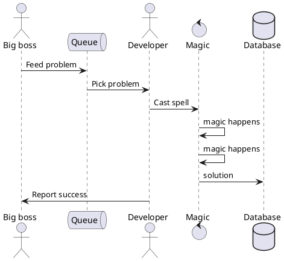

# What your boss loves

```plantuml
@startuml bossloves
actor  "Big boss" as bb
queue Queue as q
actor  Developer as dev
control Magic as mm
database  Database as db

bb -> q : Feed problem
q -> dev : Pick problem
dev -> mm : Cast spell
mm -> mm : magic happens
mm -> mm : magic happens
mm -> db : solution
dev -> bb : Report success
@enduml
```
